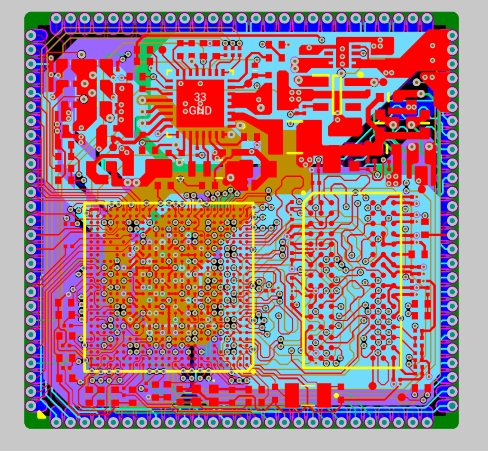
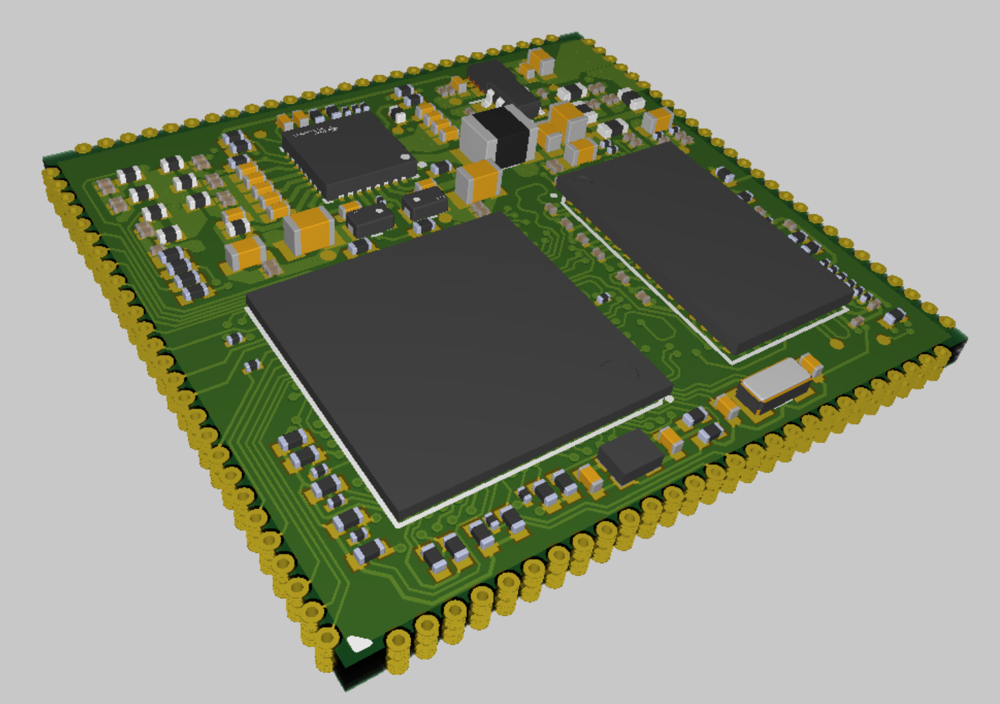
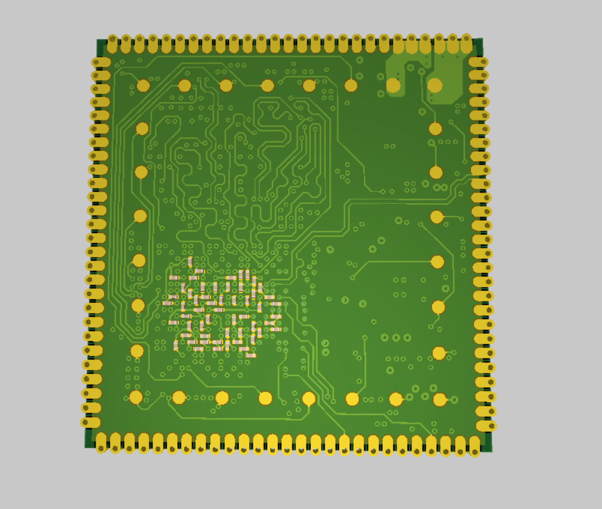
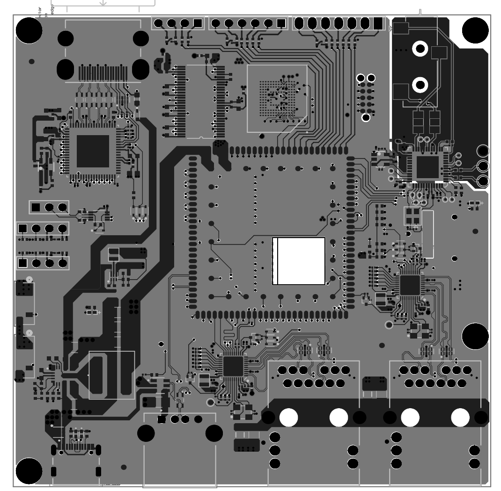
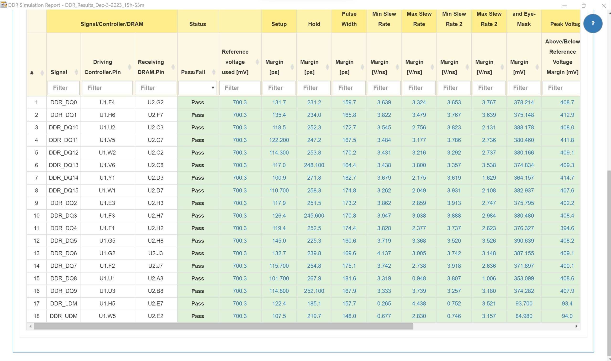
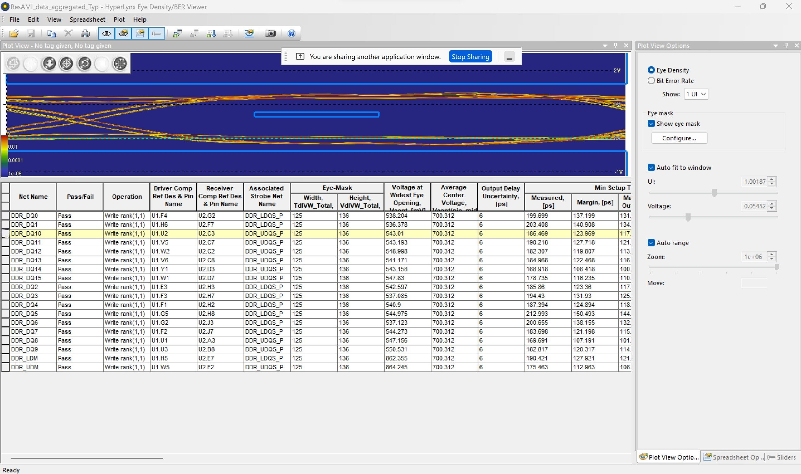

# PunyPi (tbd)

This is a standalone chiplet design that mounts the [TI AM625](https://www.ti.com/product/AM625) CortexA53 (up to 4 cores) and up to 8Gb DDR4 RAM. This chiplet allows you to create expansion boards in any size and shape you desire, and it's fully open source! This variant of the A53 runs at a higher clock than the RPi Zero 2 and we included the RAM so it is fully capable of more intensive compute tasks. 

This doesn't break out *every* feature of the AM625 but it does condense a fair amount to 30mm x 30mm on a 10 layer board. It works with standard throughole vias to help reduce PCB assembly costs. The Cortex A53 is getting older but is still one of the most popular industrial automation chips in the world and gives you good middle of the road performance - about that of a Samsung Galaxy S8 (EU edition) or Galaxy Watch 3. We're experimenting with microcomputers, servers, wearables, etc. and our best option was to design this base chiplet ourselves. 

Features:
- 1x DDR4 up to 8Gb
- 2x USB 2.0
- 1x LVDS screen (can bridge to HDMI) up to 1080p 60fps with up to Vulkan 1.2 support
- 1x JTAG
- 1x McASP Audio (4 channel)
- 2x RGMII Ethernet
- 1x MMC 5.1
- 1x SD 3.0
- UART, SPI, I2C, GPIO (and unused interfaces generally work as GPIO)
- Can be powered by 3.3V supply (up to 4A) which may change.

## Currently untested! Stay tuned!

Files were produced in Altium. You can import the PcbDoc to KiCAD there is an ASCII exported version for EAGLE importing. Chiplet footprints forthcoming for easily creating mounts for the chiplet.

We will release attachment/expansion boards for this that come prefabbed with ports etc, while the base board is just a chiplet. TI comes with standard toolings for flashing these devices, no licenses or anything required. We'll have all of this process documented for you on a full release. 

## License:

Drawings licensed under GNU GPL v3.0 (copyleft)

Please contribute to a future that's open source!

Credits:

- Drawing and validation by Nham (Paul) Phan
- Ideas/specifications by Josh Brewster and Yassine Santissi 

## Why

This is a FULLY open source alternative to RPi Zero 2. Just pay it forward and contribute to FOSS and open hardware. We're working on getting a bulk order to make these devices available at competitive prices with standard expansion boards built to house our modular ARM + RAM chiplet. We were inspired by Arducam's similar attempt with an older chipset that never saw the light of day.
